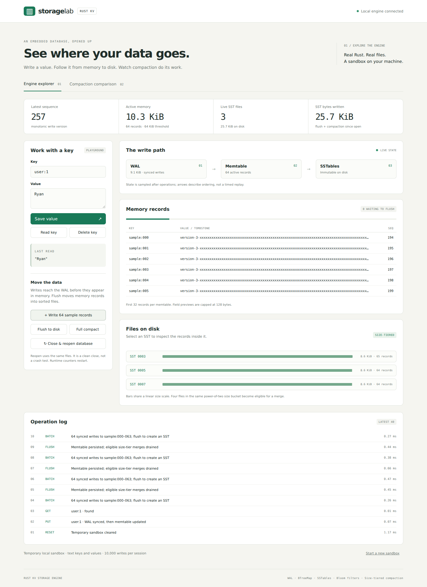
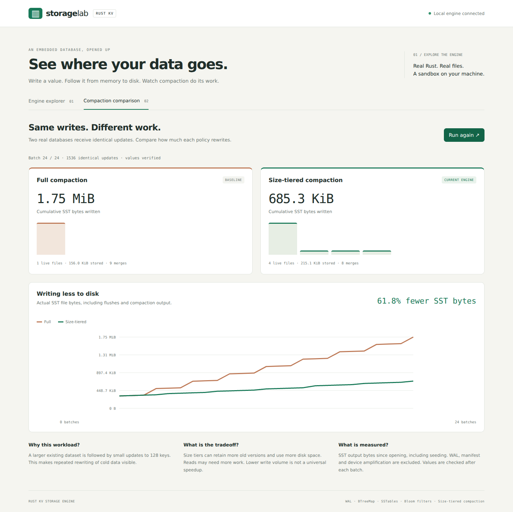

# Local storage demo

Run from the repository root on Linux or macOS:

```bash
cargo run --locked --release --example demo
```

Open **http://127.0.0.1:8080** in a browser. To use another port:

```bash
cargo run --locked --release --example demo -- 8088
```

One Rust process serves the HTML/CSS/JavaScript and calls the actual engine. No Node server, frontend build, external database, or account is needed. The UI runs in the browser; storage operations run in Rust. The server binds only to loopback. This is a local demo, not a public multi-user deployment.



## A short walkthrough

1. Save `user:1 = Ryan`, then read it. The WAL size, sequence, and memory preview change.
2. Click **Flush to disk**. A real SST appears. Select it to inspect its first records.
3. Change the value, or delete the key. A tombstone is visible in memory; an older SST may still contain the old value.
4. Click **Close & reopen database**, then read the key again. This closes all engine handles and opens the same files, replaying the WAL where needed. It is a clean reopen, not a SIGKILL test.
5. Add sample batches and flush between them to create several files. **Full compact** explicitly merges all live SSTs and can reclaim obsolete records and tombstones.
6. Open **Compaction comparison** and run the workload. Pause/resume works between batches. Both policies receive the same changes, and their values are checked after every batch.

The explorer displays sampled state after operations, not a slowed-down animation of individual disk syscalls. The operation log reports completed API calls. Runtime byte counters restart when the engine is reopened; live disk bytes and the logical sequence do not.

## Comparison



Each policy starts with 1,024 keys of eight-byte keys and 128-byte values. A full merge creates the initial dataset. Then 24 batches of 64 writes update a set of 128 keys, with a flush after each batch. The graph includes all SST output bytes since open, including seeding. WAL/manifest bytes and physical device amplification are excluded.

In the recorded local run, Full wrote 1,837,954 SST bytes and SizeTiered wrote 701,734, a 61.8% reduction. This deliberately smaller interactive workload differs from the [three-workload benchmark](compaction.md); its percentage is computed from the live run rather than copied from benchmark results. The interface also shows retained disk space and file count, since tiering can leave more old versions on disk.

## Scope and limits

- Each server launch gets a new temporary sandbox. **Reopen** preserves the current sandbox; **Start a new sandbox** explicitly clears it and the comparison. Stopping the server ends the session; it does not provide a way to resume that sandbox through the UI.
- Keys are UTF-8 text up to 128 bytes; values up to 1,024 bytes. The engine itself still supports binary data. Preview fields are capped at 128 bytes and decoded lossily for display; exact byte lengths remain available from the inspection API.
- Memory/table previews show the first 32 records. Selecting an SST shows its physical versions, which may differ from the current value returned by `get()`.
- The playground permits 10,000 mutations per session. Comparison runs are fixed in size and use two separate temporary databases. Requests are serialized; comparison progress advances one batch per request.
- The demo uses a 64 KiB memtable threshold, 4 MiB block cache per engine, and 4 KiB blocks. It keeps the latest 40 operation events. These are component limits, not an overall RSS guarantee.
- Temporary files are owned by the demo, not an existing user database. Abrupt termination can leave temporary directories behind; the startup message prints the playground path.
- `tiny_http` and `serde_json` are development dependencies for the example. The core engine has no HTTP or JSON dependency.

## Verification

```bash
cargo test --locked --all-features
cargo test --locked --release --all-features
cargo clippy --locked --all-targets --all-features -- -D warnings
cargo build --locked --release --example demo
python3 scripts/test_demo.py
```

The HTTP smoke test starts its own server on an ephemeral port. It checks writes, physical SST versions, deletion recovery, full compaction, invalid/oversized input, cross-origin/Host checks, comparison verification, and reset. It terminates the child afterward.

Recorded local checks, 2026-09-28 UTC, Rust 1.98.1:

- 42 engine tests/doctests passed in debug and release.
- HTTP smoke test passed. Reported child peak RSS was 13,440 KiB in one run; it excludes the browser and the operating system and is not a 512 MiB VPS acceptance test.
- Chromium desktop (1440 px) and mobile (390 px) checks passed: save/read/delete, SST inspection, reopen, HTML escaping, full comparison, no horizontal overflow or JavaScript console errors.

`Engine::inspect()` returns a consistent state-metadata snapshot with bounded record previews. `inspect_table(id)` clones the table handle before disk reads; it returns an error if the requested table is no longer live. `stats()` is sampled separately and is not an atomic snapshot with inspection metadata.
